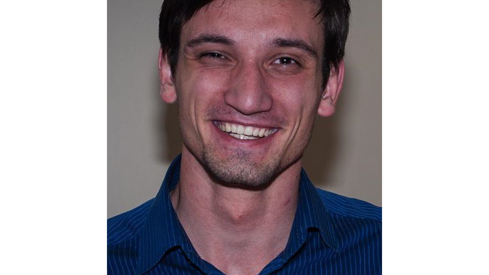

# Выступающий

Ефим Боеру, выпускник Сколтеха и МФТИ 2017 года. Ефим имеет успешный опыт работы в таких компаниях как Bosch и Huawei, а так же стажировки в MIT. Отличается высокой требовательностью к себе и широтой математического кругозора.

# Материалы

*   [Статья](/files/170930/Kim_2015_Compression_of_Deep_Convolutional.pdf), иллюстрирующая применение разложения Таккера для сверточных слоев.
*   Классная обзорная [статья](/files/170930/tensordecompositions.pdf) по тензорным разложениям.
*   Краткая [презентация](/files/170930/tensor3.pdf) по тензорным разложениям.
*   [Статья](/files/170930/Novikov.pdf) об использовании `tensor train` для полносвязных слоев.
*   Невероятно крутой [постер](/files/170930/decompositions.pdf), подготовленный студентами И.Оселедца о матричных разложениях.

